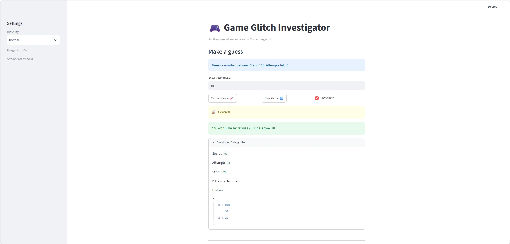
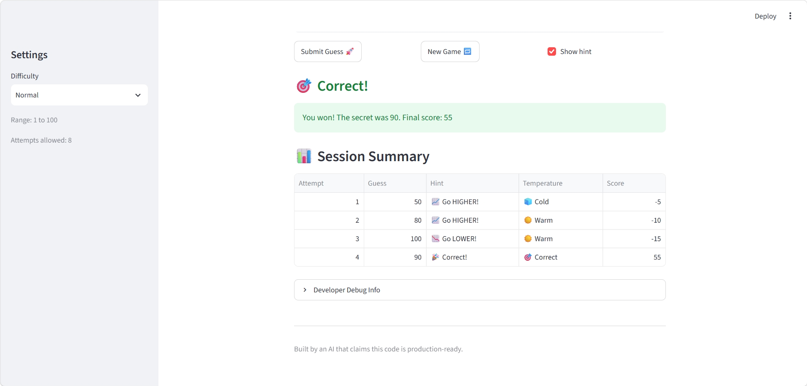

# 🎮 Game Glitch Investigator: The Impossible Guesser

## 🚨 The Situation

You asked an AI to build a simple "Number Guessing Game" using Streamlit.
It wrote the code, ran away, and now the game is unplayable. 

- You can't win.
- The hints lie to you.
- The secret number seems to have commitment issues.

## 🛠️ Setup

1. Install dependencies: `pip install -r requirements.txt`
2. Run the broken app: `python -m streamlit run app.py`

## 🕵️‍♂️ Your Mission

1. **Play the game.** Open the "Developer Debug Info" tab in the app to see the secret number. Try to win.
2. **Find the State Bug.** Why does the secret number change every time you click "Submit"? Ask ChatGPT: *"How do I keep a variable from resetting in Streamlit when I click a button?"*
3. **Fix the Logic.** The hints ("Higher/Lower") are wrong. Fix them.
4. **Refactor & Test.** - Move the logic into `logic_utils.py`.
   - Run `pytest` in your terminal.
   - Keep fixing until all tests pass!

## 📝 Document Your Experience

- [X] Describe the game's purpose.
- [X] Detail which bugs you found.
- [X] Explain what fixes you applied.

### Game purpose
This is a number-guessing game built with Python and Streamlit. The player picks a difficulty (Easy, Normal, or Hard), then tries to guess a secret number within a limited number of attempts. After each guess, the game gives a hint ("Go HIGHER" or "Go LOWER") and updates the score. Fewer guesses mean a higher score. The starter code was generated by an AI and was full of bugs; my job was to find them, fix them, and verify the fixes with tests.

### Bugs found
I found and reproduced 11 bugs (full details, inputs, and expected vs. actual results are in the Bug Reproduction Log in `reflection.md`):

1. **Attempts off by one:** attempts started at 1, so Normal showed "Attempts left: 7" instead of 8.
2. **Out-of-range guesses accepted:** Easy (1–20) accepted 101, 0, and -20.
3. **New Game didn't work:** it never reset the game status, score, or history, so the game stayed stuck on "Game over."
4. **Hard was easier than Normal:** Hard used a range of 1–50 while Normal used 1–100.
5. **Hints were backwards:** guessing too high said "Go HIGHER!"
6. **Same guess, opposite hints:** the secret was turned into text on even attempts, so 9 vs. 79 was compared as "9" > "79."
7. **Wrong range message:** the info box always said "between 1 and 100," even on Easy.
8. **Invalid input used an attempt:** typing "abc" showed an error but still counted as a guess.
9. **Switching difficulty kept the old secret:** the secret could be outside the new range (e.g., 79 on Easy).
10. **Debug panel lagged one guess behind:** it was drawn before the guess was processed.
11. **Wrong guesses could raise the score:** "Too High" on even attempts added 5 points.

*Note:* The starter instructions mention the secret number changing every time you click Submit. In my copy, the secret was already stored in `st.session_state`, so that didn't happen. The state bugs I found were New Game (#3) and switching difficulty (#9).

### Fixes applied
- **Refactor:** moved `get_range_for_difficulty`, `parse_guess`, `check_guess`, and `update_score` from `app.py` into `logic_utils.py`, so the game rules can be tested with pytest separately from the UI. `app.py` now imports them.
- **Hints (#5, #6):** `check_guess` now always compares numbers and returns only the outcome ("Win", "Too High", "Too Low"). A new `get_hint_message` function returns the correct text ("Too High" → "📉 Go LOWER!"). Removed the code that turned the secret into a string.
- **Input (#2, #8):** `parse_guess` now takes the difficulty's range and rejects out-of-range numbers, decimals, and non-numbers. `app.py` only counts an attempt after the input is valid.
- **Game state (#1, #3, #9):** a new `start_new_game()` function in `app.py` resets the secret, attempts (starting at 0), score, status, and history. It runs on first load, when New Game is clicked, and when the difficulty changes.
- **Display (#7, #10):** the info box uses the real range, and both the info box and debug panel are filled in after the guess is processed, so they're never one step behind.
- **Score (#11):** every wrong guess now costs 5 points, and a first-try win is worth 100.
- **Difficulty (#4):** Hard now uses 1–200.

Each fix is marked with a `# FIX:` comment in the code explaining what changed and how I worked with Claude on it.

## 📸 Demo Walkthrough

A sample game on the fixed version (Normal difficulty, secret shown in Developer Debug Info: 95):

1. The game opens on Normal. The sidebar says "Range: 1 to 100" and "Attempts allowed: 8," and the info box says "Guess a number between 1 and 100. Attempts left: 8."
2. User types `abc` and clicks Submit → the game shows "That is not a number." and Attempts left stays at 8.
3. User enters a guess of 100 → the game shows "Go LOWER!". Score: -5. Attempts left: 7.
4. User enters a guess of 50 → the game shows "Go HIGHER!". Score: -10. Attempts left: 6.
5. User enters a guess of 95 (the secret) → balloons appear and the game shows "You won! The secret was 95. Final score: 70"
6. User clicks New Game → the score resets to 0, History is empty, and a new secret is picked, so the user can play again.
 
**Screenshot:**

   

## 🧪 Test Results
```
$ python -m pytest -v
collected 27 items

tests/test_game_logic.py::test_winning_guess PASSED                      [  3%]
tests/test_game_logic.py::test_guess_too_high PASSED                     [  7%]
tests/test_game_logic.py::test_guess_too_low PASSED                      [ 11%]
tests/test_game_logic.py::test_too_high_hint_says_go_lower PASSED        [ 14%]
tests/test_game_logic.py::test_too_low_hint_says_go_higher PASSED        [ 18%]
tests/test_game_logic.py::test_single_digit_guess_compared_as_number PASSED [ 22%]
tests/test_game_logic.py::test_same_guess_gives_same_result_every_time PASSED [ 25%]
tests/test_game_logic.py::test_out_of_range_guess_rejected_on_easy PASSED [ 29%]
tests/test_game_logic.py::test_non_numeric_input_rejected PASSED         [ 33%]
tests/test_game_logic.py::test_wrong_guess_never_adds_points PASSED      [ 37%]
tests/test_game_logic.py::test_first_try_win_scores_100 PASSED           [ 40%]
tests/test_game_logic.py::test_hard_range_bigger_than_normal PASSED      [ 44%]
tests/test_game_logic.py::test_negative_number_rejected PASSED           [ 48%]
tests/test_game_logic.py::test_decimal_rejected_not_truncated PASSED     [ 51%]
tests/test_game_logic.py::test_extremely_large_number_rejected PASSED    [ 55%]
tests/test_game_logic.py::test_empty_input_rejected PASSED               [ 59%]
tests/test_game_logic.py::test_whitespace_around_number_accepted PASSED  [ 62%]
tests/test_game_logic.py::test_boundary_values PASSED                    [ 66%]
tests/test_game_logic.py::test_win_score_never_below_10 PASSED           [ 70%]
tests/test_game_logic.py::test_temperature_correct_guess PASSED          [ 74%]
tests/test_game_logic.py::test_temperature_ratings_from_hot_to_cold PASSED [ 77%]
tests/test_game_logic.py::test_temperature_scales_with_range PASSED      [ 81%]
tests/test_game_logic.py::test_first_win_sets_high_score PASSED          [ 85%]
tests/test_game_logic.py::test_lower_score_does_not_replace_high_score PASSED [ 88%]
tests/test_game_logic.py::test_high_scores_are_tracked_per_difficulty PASSED [ 92%]
tests/test_game_logic.py::test_high_scores_save_and_load_round_trip PASSED [ 96%]
tests/test_game_logic.py::test_missing_or_broken_high_score_file_is_empty PASSED [100%]

============================= 27 passed in 0.09s ==============================
```

The full output is also saved in `test_results.txt`.

## 🚀 Stretch Features
- [x] **Challenge 1: Advanced Edge-Case Testing.** Added edge-case tests for negative numbers, decimals, extremely large numbers, empty input, extra spaces, and range boundaries (see the "Edge-case tests" section of `tests/test_game_logic.py`). Prompts and reasons for each edge case are in `ai_interactions.md`.

- [x] **Challenge 2: Feature Expansion (High Score tracker).** Built with Claude working as an agent. When you win, your score is saved to `high_scores.json` if it beats the best for that difficulty, the game shows "🏆 New high score!", and the sidebar always lists the best score for Easy, Normal, and Hard, even after the game is restarted. New functions: `load_high_scores()`, `save_high_scores()`, and `update_high_score()` in `logic_utils.py`, plus 5 tests. Full Agent Workflow in `ai_interactions.md`. I also added a "ℹ️ How scoring works" panel to the sidebar that explains the two parts of the score with a worked example.

- [x] **Challenge 3: Professional Documentation and Linting.** Every function in `logic_utils.py` has a professional docstring with Args, Returns, and Examples. I ran `flake8` (a PEP 8 checker) on `app.py`, `logic_utils.py`, and the tests: it found 46 warnings before (saved in `lint_before.txt`) and 0 after (saved in `lint_after.txt`). The prompt, linting output, and the changes applied are in `ai_interactions.md`.

- [x] **Challenge 4: Enhanced Game UI.** Added three UI improvements without changing the core game rules:
  - **Hot/Cold meter:** a new function `get_temperature()` in `logic_utils.py` rates each guess as 🔥 Hot, ☀️ Warm, 🌥️ Cool, or 🧊 Cold based on how close it is, measured as a fraction of the difficulty's range (so "close" on Easy feels the same as "close" on Hard). A correct guess shows 🎯 Correct.
  - **Color-coded hints:** in `app.py`, the hint is now shown with `st.markdown` in a color that matches the temperature (red, orange, gray, blue, or green for a win), followed by "Go HIGHER" / "Go LOWER." This replaced the plain yellow `st.warning` box.
  - **Session summary table:** `app.py` keeps a `guess_log` in session state (reset by `start_new_game()`) and shows a "📊 Session Summary" table with each guess's attempt number, guess, hint, temperature, and score.
  - Added 3 tests for `get_temperature()` in `tests/test_game_logic.py`.
  

- [x] **Challenge 5: AI Model Comparison.** I gave ChatGPT and Claude the same prompt to fix the backwards hints and string comparison bugs (#5 and #6) in the original `check_guess`. Claude's fix was more Pythonic (it handled bad input instead of crashing), while ChatGPT's explanation was easier to follow. The full comparison and both models' code are in `ai_interactions.md`.
